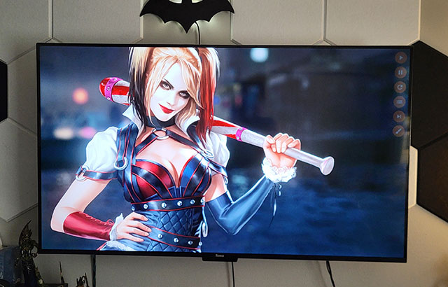

# Digital Picture Viewer

This project was my first step into the electron world.

The application was created because I have a lot of images stored and wanted to view on large screen TV/Display but i wanted to be able set the interval. I had a quick look around and i couldn't find anything for free.

This project and software is for Non-Commercial Use Only.

For Commercial use feel free to contact me.

## Features

- Multiple Directories: Select multiple image directories.
- Slideshow: Displays images from the selected image directories.
- Custom Interval: Select the duration between image changes, in minutes or seconds.
- Display Options: Crop or not crop the image display, if not cropped it will center the image based of the height of the image, any remaining space will show a faded version of the image behind. The background color is also configurable.
- Full Screen Mode: Allow the player to go full screen by pressing F11.
- Power Management: It disables the power management so the display will not go to sleep.

## Install Application without Compiling

Download the Windows exe file in the publish directory.

A configuration file is created in your user directory  ..\AppData\Roaming\digital-picture\digital-picture-preferences.json

## Development Run:
 * npm install
 * npm run electron-build

## Development Build / Publish:
 * npm run make

## License

[License](LICENSE)

## Author

This project was created by nick Coleman in 2025.
