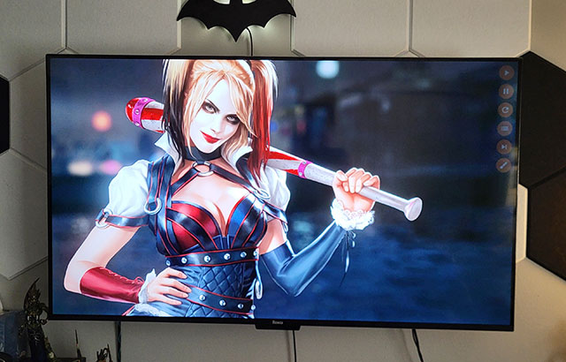

# Digital Picture Viewer

This project was my first step into the electron world.

The application was created because I have a lot of images stored and wanted to view on large screen TV/Display but i wanted to be able set the interval. I had a quick look around and i couldn't find anything for free.

This project and software is for Non-Commercial Use Only.

For Commercial use feel free to contact me.

## Features

- Image Groups: Organise folders into groups (e.g. "Holidays", "Wallpaper") and switch between them from the slideshow. Sub folders can be included per folder.
- Slideshow: Displays images (jpg, png, gif, webp, bmp) from the folders in the current group, ordered by name or date modified.
- Custom Interval: Select the duration between image changes, in minutes or seconds.
- Transitions: Fade, fade through black, slide left, slide up, zoom, wipe or random. Transitions play when the interval is longer than 10 seconds.
- Fill the Screen: Crop images to fill the screen, focusing on the top, the center, or smart focus.
- Smart Focus: Finds the faces (or the main subject when there are none) in each image and keeps them in view when cropping. Runs offline, results are cached.
- Fit Mode: When not filling the screen the image is fitted to the height, any remaining space can show a faded version of the image behind. The background color is also configurable.
- Controls: Move the mouse or press a key to show the controls (previous, play/pause, next, up next, image groups, preferences, full screen). They hide again after a few seconds, along with the cursor.
- Up Next: See the remaining images, jump to one, or remove it from the play list.
- Light/Dark: The preferences follow the Windows light/dark setting, or can be set to light or dark.
- Power Management: The application temporarily disables the power management so the display will not go to sleep.

Other screen shot can be seen in the ./src/assets directory

## Keyboard Shortcuts

| Key | Action |
|---|---|
| Space | Play / pause |
| → / ← | Next / previous image |
| F or F11 | Toggle full screen |
| Esc | Close the up next list, or leave full screen |
| F1 / F2 / F3 | Play / pause / next (menu shortcuts) |

## Install Application without Compiling

Download the Windows exe files.

Settings are saved automatically in your user directory:

- ..\AppData\Roaming\digital-picture\digital-picture-preferences.json (preferences, groups and the current play list)
- ..\AppData\Roaming\digital-picture\digital-picture-focus.json (smart focus cache, safe to delete, it is rebuilt as images are shown)

## Requirements for Development

- Node.js 22.22.3 or later (Angular 22 will not run on older versions). If you use nvm: `nvm install 26 && nvm use 26`
- Built with Angular 22, Angular Material 22 and Electron 44.

## Development Run:
 * npm install
 * npm run electron-build

## Tests:
 * npm test

## Development Build / Publish:
 * npm run make

This builds the Angular app and then the installer.

Before running a "make" command make sure you delete everything in your "out" directory.

if you see the error:

    This is a dummy update.exe.  If you are seeing this, your build did not correctly replace the IDR_UPDATE_ZIP resource.

This probaly because you forgot to delete the "out" directory and your exe file is too big.

## Credits

- Face detection: [MediaPipe](https://ai.google.dev/edge/mediapipe) (Apache 2.0), BlazeFace short range model.
- Subject detection: [smartcrop.js](https://github.com/jwagner/smartcrop.js) (MIT).

## License

[License](LICENSE)

## Author

This project was created by Nick Coleman in 2025.
